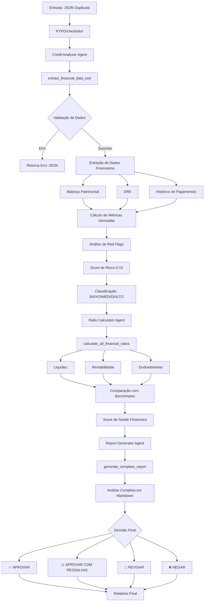

# KYP Credit Analysis System

Sistema automatizado de análise de crédito para duplicatas escriturais utilizando Google ADK (Agent Development Kit) e IA Generativa.

## Visão Geral

O KYP (Know Your Payable) é um sistema inteligente de análise de crédito que processa dados financeiros de empresas e gera relatórios completos de análise de risco creditício de forma automatizada. O sistema utiliza múltiplos agentes especializados trabalhando em sequência para realizar análise financeira abrangente.

## Fluxograma do Sistema



## Arquitetura do Sistema

### Estrutura de Diretórios

```
kyp/
├── kyp_agent/
│   ├── agent.py                    # Orquestrador principal (SequentialAgent)
│   ├── __init__.py                 # Exporta root_agent
│   ├── sub_agents/
│   │   ├── __init__.py             # Exporta os 3 agentes
│   │   ├── credit_analyzer.py      # Agente de análise de crédito
│   │   ├── credit_analyzer_prompt.py
│   │   ├── ratio_calculator.py     # Agente de cálculo de índices
│   │   ├── ratio_calculator_prompt.py
│   │   ├── report_generator.py     # Agente gerador de relatório
│   │   └── report_generator_prompt.py
│   └── tools/
│       ├── __init__.py
│       ├── credit_analyzer_tool.py       # Extração de dados financeiros
│       ├── calculation_tools.py          # Cálculos de índices financeiros
│       └── generate_complete_report.py   # Geração de relatório markdown
├── data/                           # Dados de entrada (JSON duplicatas)
├── requirements.txt
└── README.md
```

## Componentes Detalhados

### 1. KYPOrchestrator (SequentialAgent)

Agente raiz que coordena o fluxo sequencial de análise:

```python
Credit Analysis → Ratio Calculation → Final Report
```

**Arquivo:** `kyp_agent/agent.py`

**Responsabilidade:** Executar os 3 sub-agentes em ordem e garantir que os dados fluam corretamente entre eles.

---

### 2. Credit Analyzer Agent

**Modelo:** `gemini-2.5-flash`

**Descrição:** Analista sênior de crédito especializado em extração de dados e avaliação preliminar de risco.

**Ferramenta:** `extract_financial_data_tool`

**Entrada:** JSON com dados da duplicata

**Saída:**
```json
{
  "status": "success",
  "risk_level": "BAIXO" | "MÉDIO" | "ALTO",
  "risk_score": 7.5,
  "extracted_data": {...},
  "red_flags": [...],
  "positive_points": [...],
  "preliminary_recommendation": "PROSSEGUIR - Perfil adequado"
}
```

**Lógica de Scoring:**

| Critério | Pontos | Condição |
|----------|--------|----------|
| **Liquidez** | 0-3 pts | Liquidez corrente ≥ 1.5 (3pts), ≥ 1.0 (2pts), ≥ 0.8 (1pt) |
| **Saúde Financeira** | 0-3 pts | Patrimônio líquido > 0 (1.5pts) + Lucro líquido > 0 (1.5pts) |
| **Histórico de Pagamentos** | 0-4 pts | Sem atrasos (4pts), ≤10% atrasos (2pts), ≤30% (1pt) |

**Total:** 0-10 pontos

**Classificação:**
- BAIXO: ≥ 7.0
- MÉDIO: 4.0 a 6.9
- ALTO: < 4.0

**Red Flags Críticos:** Limitam o score a máximo 3.5 pontos.

---

### 3. Ratio Calculator Agent

**Modelo:** `gemini-2.5-flash`

**Descrição:** Analista financeiro quantitativo especializado em cálculo e interpretação de índices.

**Ferramenta:** `calculate_all_financial_ratios`

**Entrada:** `extracted_data` do agente anterior

**Saída:**
```json
{
  "status": "success",
  "liquidity": {
    "ratios": {"current_ratio": 1.85, "quick_ratio": 1.85, "working_capital": 50000},
    "interpretation": {...},
    "alerts": [...],
    "strengths": [...]
  },
  "profitability": {
    "ratios": {"roe": 0.18, "roa": 0.09, "margem_liquida": 0.15, ...},
    "interpretation": {...}
  },
  "debt": {
    "ratios": {"debt_ratio": 0.45, "debt_to_equity": 1.2, ...},
    "interpretation": {...}
  },
  "benchmark_comparison": {...},
  "financial_health_score": 8.2,
  "summary": "A empresa apresenta saúde financeira geral de 8.2/10..."
}
```

**Índices Calculados:**

#### Liquidez
- Liquidez Corrente
- Liquidez Seca
- Capital de Giro

#### Rentabilidade
- ROE (Return on Equity)
- ROA (Return on Assets)
- Margem Bruta
- Margem Líquida
- Margem EBITDA

#### Endividamento
- Debt Ratio (Dívida/Ativos)
- Debt-to-Equity
- Equity Multiplier
- Composição da Dívida (CP/Total)
- Cobertura de Juros

**Benchmarks:** Os índices são comparados com padrões setoriais predefinidos para classificar como "Excelente", "Bom", "Adequado" ou "Abaixo do esperado".

---

### 4. Report Generator Agent

**Modelo:** `gemini-2.5-flash`

**Descrição:** Escritor profissional de relatórios especializado em documentação de análise de crédito.

**Ferramenta:** `generate_complete_report`

**Entrada:**
- `credit_analysis` (saída do Credit Analyzer)
- `financial_ratios` (saída do Ratio Calculator)

**Saída:**
```json
{
  "status": "success",
  "report": "# RELATÓRIO DE ANÁLISE DE CRÉDITO\n...",
  "final_decision": "APROVAR" | "APROVAR COM RESSALVAS" | "REVISAR" | "NEGAR",
  "metadata": {
    "generated_at": "2025-12-09T...",
    "report_length": 15432,
    "sections": 4
  }
}
```

**Estrutura do Relatório:**

1. **RESUMO EXECUTIVO**
   - Dados da empresa e duplicata
   - Síntese da avaliação
   - Scores principais

2. **ANÁLISE DE RISCO**
   - Pontos de atenção (red flags)
   - Pontos positivos
   - Notas do analista

3. **INDICADORES FINANCEIROS**
   - 3.1 Liquidez
   - 3.2 Rentabilidade
   - 3.3 Endividamento
   - 3.4 Comparação com Setor

4. **RECOMENDAÇÃO FINAL**
   - Decisão: APROVAR/APROVAR COM RESSALVAS/REVISAR/NEGAR
   - Condições sugeridas (taxa, prazo, garantias)
   - Plano de monitoramento

**Lógica de Decisão:**

| Decisão | Condições | Taxa Sugerida | Prazo | Garantias |
|---------|-----------|---------------|-------|-----------|
| **APROVAR** | Risk Score ≥ 7.0 E Health Score ≥ 8.0 | CDI + 2.5% a.a. | 180 dias | Duplicata escritural |
| **APROVAR COM RESSALVAS** | Risk Score ≥ 5.0 E Health Score ≥ 6.0 | CDI + 4.0% a.a. | 120 dias | Duplicata + Aval sócios |
| **REVISAR** | Risk Score ≥ 4.0 | A definir | A definir | Garantias reais |
| **NEGAR** | Risk Score < 4.0 | N/A | N/A | N/A |

---

## Formato de Entrada

O sistema espera um JSON com a seguinte estrutura:

```json
{
  "empresa": {
    "cnpj": "12.345.678/0001-90",
    "razao_social": "TechSolutions Inovação Ltda",
    "setor": "Tecnologia"
  },
  "duplicata": {
    "valor": 150000.00,
    "vencimento": "2025-06-30"
  },
  "financeiro": {
    "balanco_patrimonial": {
      "ativo_circulante": 500000,
      "ativo_nao_circulante": 300000,
      "passivo_circulante": 200000,
      "passivo_nao_circulante": 150000,
      "patrimonio_liquido": 450000
    },
    "dre": {
      "receita_bruta": 1200000,
      "receita_liquida": 1000000,
      "lucro_bruto": 600000,
      "lucro_operacional": 250000,
      "lucro_liquido": 180000,
      "ebitda": 300000
    },
    "historico_pagamentos": [
      {
        "valor": 50000,
        "status": "PAGO",
        "dias_atraso": 0
      },
      {
        "valor": 75000,
        "status": "PAGO",
        "dias_atraso": 3
      }
    ]
  }
}
```

## Instalação

```bash
# Clone o repositório
git clone <repo-url>
cd kyp

# Crie um ambiente virtual
python -m venv .venv
source .venv/bin/activate  # Windows: .venv\Scripts\activate

# Instale as dependências
pip install -r requirements.txt
```

## Uso

```python
from kyp_agent import root_agent

# Carregar dados da duplicata
import json
with open('data/duplicata_exemplo.json', 'r') as f:
    duplicata_data = json.load(f)

# Executar análise completa
resultado = root_agent.run(json.dumps(duplicata_data))

# O resultado contém o relatório markdown completo
print(resultado['final_report'])
```

## Dependências

```
google-adk          # Framework de agentes do Google
pytest>=7.4.0       # Testes
pytest-cov>=4.1.0   # Cobertura de testes
pytest-asyncio>=0.21.0  # Suporte assíncrono para testes
```

## Validações e Tratamento de Erros

O sistema implementa validação rigorosa em cada etapa:

### Validações de Entrada:
- ✅ Estrutura JSON válida
- ✅ Presença de seções obrigatórias (empresa, duplicata, financeiro)
- ✅ Formato CNPJ válido (14 dígitos)
- ✅ Data de vencimento em formato ISO 8601
- ✅ Valor da duplicata positivo
- ✅ Valores numéricos não negativos

### Tratamento de Erros:
Todos os erros retornam JSON estruturado:

```json
{
  "status": "error",
  "error": "tipo_do_erro",
  "message": "Descrição detalhada do erro",
  "invalid_fields": ["campo1", "campo2"]
}
```

## Características Principais

### Determinístico e Confiável
- Lógica de scoring transparente e auditável
- Sem "alucinações" - apenas dados fornecidos
- Cálculos matemáticos precisos

### Modular e Extensível
- Agentes independentes e especializados
- Ferramentas reutilizáveis
- Fácil adição de novos agentes ou índices

### Compliant e Profissional
- Relatórios formatados para comitês de crédito
- Rastreabilidade completa (timestamps, metadata)
- Disclaimers e assinaturas incluídos

### Performance Otimizada
- Uso de modelo flash (gemini-2.5-flash) para latência mínima
- Processamento sequencial eficiente
- Logging estruturado para debug

## Logs e Observabilidade

O sistema utiliza logging estruturado:

```python
import logging
logger = logging.getLogger(__name__)

# Logs em cada ferramenta:
logger.info("Starting liquidity ratios calculation")
logger.debug(f"Liquidity details: {len(alerts)} alerts, {len(strengths)} strengths")
logger.exception("Unexpected error in calculate_liquidity_ratios")
```

## Futuras Melhorias

- [ ] Integração com APIs de bureaus de crédito (Serasa, Boa Vista)
- [ ] Dashboard web para visualização de relatórios
- [ ] Análise temporal (comparação com períodos anteriores)
- [ ] Machine Learning para ajuste dinâmico de benchmarks
- [ ] Suporte a múltiplas moedas
- [ ] API REST para integração externa
- [ ] Testes unitários e de integração completos

## Contribuindo

Contribuições são bem-vindas! Por favor:

1. Faça fork do projeto
2. Crie uma branch para sua feature (`git checkout -b feature/AmazingFeature`)
3. Commit suas mudanças (`git commit -m 'Add some AmazingFeature'`)
4. Push para a branch (`git push origin feature/AmazingFeature`)
5. Abra um Pull Request

## Licença

Este projeto é proprietário e confidencial.

## Contato

Para dúvidas ou suporte, entre em contato com a equipe de desenvolvimento.

---

**Versão:** 1.0
**Última Atualização:** 2025-12-09
**Status:** Em Produção